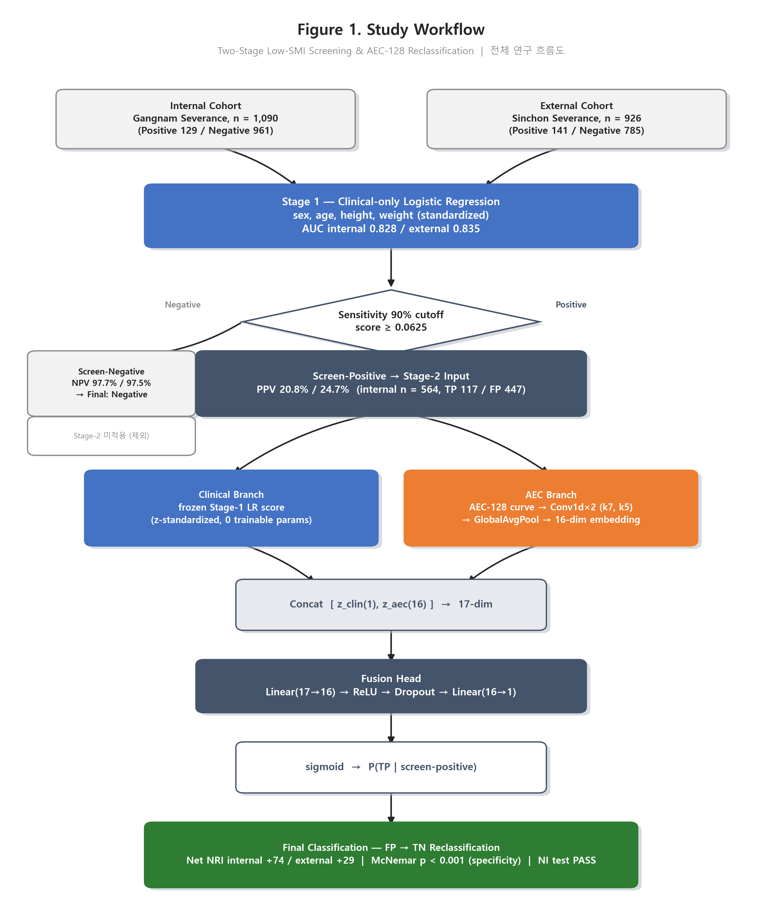

# 2단계 스크리닝 구조에서 Clinical-only 모델의 AEC-128 곡선 기반 Stage-2 재분류: Frozen Logistic Score와 1D-CNN Intermediate Fusion을 이용한 Low Skeletal Muscle Mass Index 재분류 알고리즘

**저자:** 전장훈 (JangHoon Chun)
**소속:** 강남세브란스병원 의료기기산업학과, 연세대학교 의과대학
**자료 기준일:** 2026-07-24 (`docs/260724_Results_of_Residual_Algorithm.pptx` 16장 슬라이드 + speaker notes 전체를 원 자료로 재구성)

> 본 문서는 위 발표자료(pptx)의 슬라이드 본문·표·speaker notes를 논문 형식으로 재구성한 연구 경과 보고이며, 신규 분석을 추가하지 않았다. 슬라이드에 없던 배경 설명(예: raw/unmatched 비교 결과)은 speaker notes에 있던 구두 설명용 문구를 본문에 편입한 것으로, 해당 부분은 각주로 출처를 표시했다.

---

## 초록 (Abstract)

**배경**: 저근감(Low skeletal muscle mass index, Low-SMI)은 노쇠·수술 후 합병증·사망률과 연관되어 조기 스크리닝의 임상적 가치가 크다[1,2]. 성별·나이·키·체중 4개 인체계측 변수만으로 구성한 Stage-1 로지스틱회귀는 AUC internal 0.828 / external 0.835로 양호하나, 스크리닝에 요구되는 고민감도 운영점에서는 특이도(Sp)와 양성예측도(PPV)가 구조적으로 낮아진다.

**방법**: Stage-1을 Sensitivity 90%(S90) cutoff로 운용해 screen-positive군만 선별하고, 이 군에 한해 AEC-128(자동노출제어 임피던스 곡선) 신호를 결합하는 Stage-2 재분류 모델을 개발했다. Stage-2는 (a) frozen Stage-1 로지스틱 점수(z-표준화, 0 학습 파라미터)와 (b) AEC-128 곡선을 1D-CNN + GlobalAvgPool로 인코딩한 16차원 임베딩을 concat한 뒤 fusion head로 결합하는 intermediate-fusion 구조다. Stage-1 코호트: internal(Gangnam, n=1090, Positive 129/Negative 961) / external(Sinchon, n=926, Positive 141/Negative 785). Stage-2 학습군(screen-positive)은 internal n=564(TP 117/FP 447)이며, class rebalancing(SMOTE 등)은 적용하지 않고 원본 비율을 유지했다[12–15].

**결과**: S90 cutoff에서 Sp 53.59%(internal)/49.04%(external), PPV 20.78%/24.67%로 구조적으로 낮았다. Propensity-score matching(Hungarian algorithm, caliper 0.2×SD logit-propensity, 매칭 후 SMD<0.08)[18,19] 후 AEC-128 곡선 RMSD 비교에서 Gangnam은 신호 소실(RMSD 0.0057, p=0.983, 97쌍), Sinchon은 신호 잔존(RMSD 0.0422, p=0.0165, 94쌍)으로 코호트 의존적 결과가 나타났다. Stage-2 최종 모델은 Net NRI internal +74 / external +29(Stage-1 score 표준화 반영 후, 표준화 전 external +15), 특이도 개선 McNemar p<0.001(양 코호트), Non-inferiority(NI) 기준 PASS(민감도 손실이 margin 이내)를 달성했다. 전체 코호트 AUC는 DeLong 검정상 Stage-1 대비 유의한 차이가 없었다(internal p=0.458, external p=0.503) — AUC는 marker의 incremental value 검출에 저출력이므로[40,41] NRI/McNemar를 1차 유의성 지표로 채택했다. Clinical branch를 MLP(688 파라미터)→Linear(80)→frozen LR(0 파라미터)로 단순화할수록 Net NRI가 개선(+38/+10 → +29/+23 → +74/+29)되었고, AEC branch는 반대로 GlobalAvgPool 1D-CNN(400 파라미터, 현 구조)이 더 큰 용량의 변형들보다 우수했다(convpool_avgmax는 external Net NRI +90으로 최고였으나 NI FAIL로 기각).

**결론**: Clinical 변수의 예측 상한 근처에서는 AEC 곡선 정보를 결합한 저용량 intermediate-fusion 모델이 screen-positive군의 FP를 유의하게 TN으로 재분류하며, 이 개선은 AUC보다 NRI/McNemar에서 더 잘 포착된다. 다만 raw AEC 신호의 코호트 간 불일치가 propensity matching만으로 해소되지 않아, cross-validated confound regression 등 추가 confound 제거 절차[20–22]가 다음 단계 과제로 남는다.

**키워드**: Low skeletal muscle mass index, sarcopenia screening, two-stage classifier, AEC impedance curve, intermediate fusion, net reclassification improvement, propensity score matching

---

## 1. 서론

### 1.1 임상적 배경

저근감(Low-SMI)은 노쇠, 수술 후 합병증, 사망률과 연관되어 조기 스크리닝의 임상적 가치가 크다[1,2]. 본 연구는 Low-SMI를 `SMI = TAMA / Height(m)²`로 정의하고, 성별에 따른 cutoff(남성 SMI<45.4, 여성 SMI<34.4)를 양성 기준으로 사용한다. 이 정의는 프로젝트 전체에서 단일하게 사용되며, 사전 계산된 `SMI` 유사 컬럼을 신뢰하지 않고 매 스크립트에서 위 식으로 재계산한다.

### 1.2 2단계 스크리닝 설계의 동기

성별·나이·키·체중 4개 인체계측 변수만으로 구성한 Stage-1 로지스틱회귀는 AUC internal 0.828 / external 0.835로, Hosmer-Lemeshow 기준 acceptable(0.7–0.8)과 excellent(0.8–0.9)의 경계에 위치한다[3]. 이 자체로는 나쁘지 않은 출발점이지만 두 가지 이유로 개선 여지가 남는다.

1. 스크리닝 특성상 요구되는 고민감도 운영점(Sensitivity 90%)에서 특이도·PPV가 구조적으로 낮아진다(§3.2).
2. Clinic 4개 인체계측 변수는 체성분(특히 골격근량)의 간접적 대리지표일 뿐 근육의 질·조성을 직접 반영하지 않으므로, anthropometry만으로 설명 가능한 분산에는 이론적 상한이 있다[10,11].

Clinic과 독립적인 정보원인 AEC(자동노출제어) 임피던스 곡선을 결합하면 이 상한을 넘어설 가능성이 있다는 가설 아래, Stage-1이 screen-positive로 분류한 군에 한해 AEC-128 곡선을 결합하는 Stage-2 재분류 모델을 설계·검증했다.

### 1.3 연구 목표

1. Stage-1 clinical-only 모델의 성능과 고민감도 운영점에서의 한계를 정량화한다(§3.1–3.2).
2. TP/FP 두 군 간 AEC-128 곡선 신호 차이가 clinical covariate confound로 설명되는지, propensity-score matching으로 검증한다(§3.3).
3. AEC 곡선과 Stage-1 정보를 결합한 Stage-2 재분류 모델을 구축하고, 그 성능 개선을 NRI/McNemar/NI 기준으로 검증한다(§3.4).
4. 모델 용량(파라미터 수)과 재분류 성능의 관계를 clinical/AEC 두 branch 각각에서 ablation으로 규명한다(§3.5–3.6).

---

## 2. 방법

**그림 1. 전체 연구 흐름도(Study Workflow)**



*그림 1 설명*: 전체 파이프라인은 두 코호트(Internal/External, 표 1)에 동일하게 적용되는 Stage-1 clinical-only 스크리닝과, 그 screen-positive 출력만을 입력으로 받는 Stage-2 AEC 재분류로 구성된다. Stage-1은 Sensitivity 90% cutoff(threshold score=0.0625)로 운용되며, screen-negative군은 NPV가 이미 충분히 높아(97.7%/97.5%) Stage-2를 거치지 않고 Negative로 확정한다. Screen-positive군(PPV 20.8%/24.7%로 낮음)만 Stage-2 intermediate-fusion 모델에 입력되어, frozen Stage-1 점수(clinical branch)와 AEC-128 곡선(AEC branch)을 결합해 FP를 TN으로 재분류한다.

### 2.1 연구 설계 및 코호트

Internal 코호트는 강남세브란스병원(Gangnam) 자료(n=1090), External 코호트는 신촌세브란스병원(Sinchon) 자료(n=926)이며, 두 코호트 모두 metadata(성별·나이·신장·체중·TAMA)와 환자별 128-slice AEC(자동노출제어) 임피던스 곡선(patient-normalized)을 포함한다. Ground truth는 `SMI = TAMA / Height(m)²`, cutoff 남성<45.4·여성<34.4로 정의한 Low-SMI 양성 여부다. 두 코호트의 기술통계는 표 1과 같다.

**표 1. 코호트별 기술통계 (Dataset Characteristics)**

<table>
<thead>
<tr><th>변수</th><th>Internal (Gangnam), n=1090</th><th>External (Sinchon), n=926</th></tr>
</thead>
<tbody>
<tr><td>나이(세), mean±SD</td><td>57.0 ± 12.2</td><td>59.5 ± 12.7</td></tr>
<tr><td>신장(cm), mean±SD</td><td>162.2 ± 8.2</td><td>162.5 ± 8.6</td></tr>
<tr><td>체중(kg), mean±SD</td><td>61.9 ± 10.6</td><td>61.8 ± 11.4</td></tr>
<tr><td>SMI(kg/m²), mean±SD</td><td>45.4 ± 8.4</td><td>46.2 ± 8.8</td></tr>
<tr><td>남성, n(%)</td><td>390 (35.8%)</td><td>428 (46.2%)</td></tr>
<tr><td>여성, n(%)</td><td>700 (64.2%)</td><td>498 (53.8%)</td></tr>
<tr><td>Low-SMI Positive, n(%)</td><td>129 (11.8%)</td><td>141 (15.2%)</td></tr>
<tr><td>Low-SMI Negative, n(%)</td><td>961 (88.2%)</td><td>785 (84.8%)</td></tr>
<tr><td>AEC 입력 형식</td><td colspan="2" align="center">128-slice, patient-normalized 곡선 (<code>aec_128</code> 시트) — 두 코호트 공통</td></tr>
</tbody>
</table>

External 코호트는 Internal 대비 남성 비율이 더 높고(46.2% vs 35.8%) 평균 연령이 더 높다(59.5세 vs 57.0세) — 두 코호트 간 인구학적 구성 차이가 존재하며, 이는 §3.3에서 관찰되는 AEC 곡선 신호의 코호트 의존성을 해석할 때 함께 고려해야 할 배경 요인이다.

**설계**: Serial(AND-rule) 2-stage 구조(그림 1). Stage-1(clinical-only, 고민감도) → screen-positive만 Stage-2(AEC 결합)로 전달. 이 구조에서 Sp_combined = Sp1 + (1−Sp1)×Sp2 ≥ Sp1이 항상 성립하므로[8,9], Stage-1은 특이도를 확보할 필요가 없고 Stage-2가 그 역할을 담당한다.

### 2.2 Stage-1: Clinical-only 로지스틱 회귀

입력 변수는 성별(sex_M), 나이·키·체중(표준화, age_std/height_std/weight_std)이며, 표준 로지스틱 회귀로 학습했다. 표준화 계수 기준 모델 식:

```
log-odds(low-SMI) = 0.7805·age_z + 0.3800·height_z + 1.5382·weight_z − 1.6348·sex_M − 2.9516
```

|coefficient| 기준 weight(1.5382) > sex_M(−1.6348, 이진변수라 단위 상이) > age(0.7805) > height(0.38) 순으로, 체중이 연속형 변수 중 가장 큰 영향을 준다. sex_M 계수가 음수인 것은 cutoff 자체가 성별로 다르게 설정된 데 따른 보정이며(남성이면 log-odds 하향), "남성이 저근감 위험이 낮다"는 임상적 해석으로 오독해서는 안 된다.

AUC는 internal 0.828 / external 0.835이다.

### 2.3 Stage-1 임계값 선택: Sensitivity 90%

Sensitivity 85/90/95% 세 후보를 비교했다. ROC 구조상 Sp(Se)는 두 클래스 score 분포가 겹치는 한(AUC<1) 단조 감소한다[4,5]. 100%에 가까워질수록 동일한 1%p Se 이득에 대한 Sp 손실 기울기가 급격히 커지는 패턴은 유사 도메인의 정량 보고(당뇨병성 망막병증 AI 스크리닝 메타분석, pooled Se 88.0%/Sp 91.2%, FNR 12%/FPR 8.8%로 100% Se를 목표치로 삼지 않음)와 방향이 일치한다[6].

또한 100% empirical sensitivity threshold는 internal n=1090 기준 양성 케이스 중 점수 최하위 1건에 고정되는 표본 크기 1의 extreme order statistic으로, 분산 추정 자체가 불가능하다[7]. Serial 구조에서 Stage-1의 낮은 Sp는 시스템 결함이 아니라 설계 파라미터이며[8,9], Stage-2가 그 보완을 담당한다.

### 2.4 Stage-1 Screen-positive 정의 및 Stage-2 학습군 구성

S90 cutoff(threshold score = 0.0625) 적용 후 Predicted Positive만 Stage-2 입력으로 사용한다. Predicted Negative군은 NPV 97.7%(internal)/97.5%(external)로 이미 충분히 신뢰 가능해 제외한다.

Stage-2 학습군의 실제 양성비율(=Stage-1 PPV)은 internal 20.78%, external 24.67%(Δ3.89%p)로, 두 코호트 간 유병률 차이가 크지 않다. SMOTE 등 인위적 리밸런싱은 calibration을 훼손하고 discrimination은 개선하지 못한다는 정량 보고(리샘플링 시 calibration intercept −1.32~−1.50, 원본 비율 대비 −0.05~0.03)[12–14]와 class prior 변경이 posterior를 그 prior에 종속시킨다는 이론적 근거[15]에 따라, 본 연구는 원본 비율을 유지하고 threshold sweep만으로 Se/Sp를 조정하는 방식을 택했다.

### 2.5 AEC-128 곡선 TP vs FP 신호 검증: Propensity-Score Matching

TP/FP 두 군의 AEC-128 곡선 차이가 clinical covariate(성별·나이·신장·체중) 분포 차이(confound)로 설명될 가능성을 배제하기 위해, 모델 기반 잔차화 대신 표본 설계 단계에서 confound를 통제하는 propensity-score matching을 적용했다[18].

**방법**: 표준화 공변량으로 로지스틱회귀 propensity score를 추정하고, logit(propensity) 기준 caliper(0.2×SD) 안에서 TP-FP 전체 총 거리를 최소화하는 전역 최적 1:1 할당(Hungarian algorithm)으로 매칭했다[19]. 매칭 후 4개 공변량 표준화 평균차(SMD)가 모두 0.08 미만(매칭 전 0.18–0.31)으로 balance를 확보했다.

**참고**: matching 이전 raw(비매칭) TP vs FP AEC-128 곡선 비교는 코호트 간 결과가 이미 불일치했다(Gangnam RMSD=0.0155, p=0.227 n.s. / Sinchon RMSD=0.0274, p=0.0175)†.

† 이 raw 비교 수치는 슬라이드 본문 표에는 없고 슬라이드5 speaker notes의 구두 설명용 배경 서술에서 가져온 것이다.

### 2.6 Stage-2 모델 구조: Intermediate Fusion

Stage-2는 두 branch의 임베딩을 concat한 뒤 공유 classification head를 함께 학습하는 구조다. 발표자료·코드 주석은 이를 "late fusion"(`LateFusionNet`)으로 표기하지만, 최근 멀티모달 융합 분류체계에 따르면 이는 decision-level late fusion이 아니라 **intermediate(feature-level) fusion**에 해당한다[38,39] — 별도로 학습된 두 모델의 최종 예측(확률)을 사후 결합하는 것이 문헌상 late fusion이며, 본 세션에서 추가한 5-seed 앙상블 평균(`LateFusionEnsemble`)이 오히려 그 정의에 더 가깝다. 본 논문에서는 이하 "intermediate fusion"으로 표기한다.

**Clinical branch**: frozen Stage-1 로지스틱 점수 1개(0 학습 파라미터). §2.7에서 서술하는 z-표준화를 거쳐 사용한다.

**AEC branch**: patient-normalized AEC-128 곡선 입력 → Conv1d(1→8, kernel=7) + ReLU → Conv1d(8→16, kernel=5) + ReLU → GlobalAveragePool(1) → Linear(16→16) + ReLU → z_aec(16차원). 총 400 파라미터.

**Fusion head**: concat[z_clin(1), z_aec(16)] = 17차원 → Linear(17→16) + ReLU + Dropout → Linear(16→1) → sigmoid → P(TP | screen-positive).

### 2.7 Stage-1 Score 표준화

Stage-2는 Stage-1이 Positive로 분류한 환자(score≥th=0.0625)만 다루므로 raw score는 항상 양수이며 우측왜도를 가진다(internal: min 0.0625, 중앙값 0.1401, 75th pct 0.2593, max 0.9553, 평균 0.2028 — 중앙값<평균). AEC branch 마지막 ReLU로 z_aec 역시 항상 ≥0이므로, concat 17차원 입력이 구조적으로 양수 쪽에 편향되어 fusion 로짓에 offset을 유발한다.

이를 해소하기 위해 raw score를 internal Stage-2 코호트(n=564) 기준 mean(0.20277)/std(0.15859)로 1회 z-표준화(fit)하고, external에는 이 값을 그대로(frozen) 적용했다 — clinical feature 표준화와 동일한 패턴이다. 판별 정보는 보존된다(FP군 평균 z=−0.197, TP군 평균 z=+0.751, 순서 유지).

### 2.8 평가 지표

- **Net NRI** = fp_removed − tp_lost. Stage-2는 screen-positive(TP/FP)만 재분류하므로 가능한 전이는 Positive→Negative 한 방향뿐이다.
- **McNemar exact test**: 특이도/민감도 변화의 discordant pair 이항검정[37].
- **Non-inferiority(NI) test**: 민감도 손실이 margin(= Stage-1 sensitivity × 0.95) 이내인지 확인.
- **DeLong test**: 전체 코호트(screen-negative는 Stage-1 점수, screen-positive는 Stage-1 threshold + Stage-2 점수로 구성한 연속 점수) 단위 Stage-1 단독 AUC vs Full-pipeline AUC의 paired 비교[33,34]. AUC는 marker의 incremental value 검출에 상대적으로 저출력이므로[40,41] NRI/McNemar를 1차 유의성 판단 기준으로 삼는다.
- 클래스 불균형 학습에는 `BCEWithLogitsLoss(pos_weight=n_neg/n_pos)`를 사용했다[23]. 이는 SMOTE류 리샘플링이 아니라 손실함수 가중이나, 원리적으로 동일한 class-prior shift 위험이 있어[24,25] 확률값 자체를 직접 보고·사용할 경우 별도 재보정이 필요함을 명시해 둔다.

### 2.9 모델 학습 절차

5-seed 앙상블 평균[29], 5-fold out-of-fold(OOF) 평가와 frozen-external 검증(internal에서 fit한 통계량을 external에는 재적합 없이 그대로 적용)을 프로토콜로 고정했다. 학습 안정화를 위해 `ReduceLROnPlateau` LR 스케줄과 `clip_grad_norm_(max_norm=1.0)`을 적용했다[26,27]. Inner-split validation-AUC 기반 조기종료는 fold당 이벤트 수가 적어(~14개) 추정 분산이 커지는 부작용으로 되돌렸다[28].

---

## 3. 결과

### 3.1 Stage-1 임계값별 FN/FP 및 한계비용

**표 2. Sensitivity 구간별 FN/FP 절대건수**

| 구간 | Internal FN | Internal FP | External FN | External FP |
| --- | --- | --- | --- | --- |
| Sens 85% | 19 | 350 | 17 | 337 |
| Sens 90% | 12 | 447 | 10 | 398 |
| Sens 95% | 6 | 582 | 5 | 529 |

**표 3. 구간 이동에 따른 한계비용**

| 구간 이동 | ΔFN | ΔFP | FN 1명 줄이는 데 드는 FP 비용 |
| --- | --- | --- | --- |
| 85%→90% (internal) | −7 | +97 | 13.9건 |
| 85%→90% (external) | −7 | +61 | 8.7건 |
| 90%→95% (internal) | −6 | +135 | 22.5건 |
| 90%→95% (external) | −5 | +131 | 26.2건 |

FN 1명당 드는 FP 비용은 85→90%p 구간보다 90→95%p 구간에서 1.6~3배 증가한다. Sp 손실 기울기 자체도 90→95%p 구간이 85→90%p 구간 대비 internal 1.17배, external 1.66배 크다. 스크리닝 목적상 FN(저근감 누락) 비용이 FP보다 크다고 가정할 때, 한계비용이 급증하기 직전인 90%p가 비용 대비 효율적인 cutoff로 채택되었다.

### 3.2 S90 Confusion Matrix 및 구조적 저특이도

Negative:Positive = 961:129(internal) / 785:141(external)의 불균형 데이터에 Sens90% cutoff를 적용하면 구조적으로 FP≫FN이 발생한다(설계상 예상된 결과). 관측값은 Sp 53.59%(internal)/49.04%(external), PPV 20.78%/24.67%이다.

이 PPV 손실은 유병률이 낮은 불균형 데이터에서 고정된 고민감도 운영점을 유지할 때 구조적으로 발생하는 결과이며, 별도의 모델 결함이 아니다. Clinical-only 변수의 설명력 상한을 뒷받침하는 근거로, anthropometric 변수 기반 골격근량 예측식 문헌은 adjusted R²=0.90(SEE=1.34kg, validation r=0.952, 개발군 n=4013/검증군 n=1003)을 보고한다[10,11] — 미설명분산 10%가 예측오차(SEE)와 같은 자릿수라면, 컷오프 근방 케이스의 오분류는 회귀계수 추정 오류가 아니라 잔차 자체에서 구조적으로 발생함을 시사한다.

따라서 PPV가 낮은 Predicted Positive군에 대해서만 Stage-2를 적용해 PPV를 높이고 FP 수를 줄이는 방향으로 가설을 세웠다.

### 3.3 AEC-128 곡선 TP vs FP 비교 (Propensity-Matched)

**표 4. Propensity-matched TP vs FP AEC-128 곡선 RMSD**

| Cohort | Curve RMSD | P-value | Matched n |
| --- | --- | --- | --- |
| Gangnam (internal) | 0.0057 | 0.983 | 97 pairs |
| Sinchon (external) | 0.0422 | 0.0165 | 94 pairs |

매칭 후 4개 공변량 SMD는 모두 0.08 미만으로 balance가 잘 통제되었다. 결과는 코호트 의존적이다: Gangnam은 매칭 후 신호가 더 확실히 사라졌고(RMSD=0.0057, p=0.983), Sinchon은 매칭 후에도 여전히 유의했다(RMSD=0.0422, p=0.0165). Confound를 표본 설계로 통제해도 코호트 간 불일치가 그대로 남는다는 것은, balance 자체의 문제가 아니라 raw AEC-128 신호가 코호트마다 다르게 발현된다는 뜻이며, 단순 confound 제거만으로는 raw AEC 단독 재분류가 불충분함을 시사한다.

### 3.4 Stage-2 Intermediate Fusion 모델 성능

**표 5. Stage-1 score 표준화 전후 Net NRI**

| 지표 | Raw score | 표준화 후 |
| --- | --- | --- |
| Net NRI (internal) | +74 | +74 (변화 없음) |
| Net NRI (external) | +15 | +29 |
| Specificity Δ | +0.022 | +0.042 |

Stage-2 코호트(screen-positive, internal TP=117/FP=447, n=564)의 raw score(Stage-1 LR predict_proba)에서 mean/std를 1회 fit하고 external에는 frozen 적용한 z-표준화(§2.7)를 반영한 최종 결과다.

- **Internal**: Net NRI +74(표준화 전후 동일 — NI-threshold 탐색이 같은 지점에 수렴). Sensitivity 0.907→0.868(McNemar p=0.0625, n.s.), Specificity 0.535→0.617(McNemar p<0.0001). NI test: floor 86.16% ≤ 86.82%, PASS.
- **External**: Net NRI +15→+29(거의 2배 개선). Sensitivity 0.929→0.901(McNemar p=0.125, n.s.), Specificity 0.493→0.535(McNemar p<0.0001). NI test: floor 88.26% ≤ 90.07%, PASS.
- **전체 코호트 AUC(DeLong)**: internal 0.828→0.830(Δ−0.001, p=0.458, n.s.), external 0.835→0.835(Δ+0.00002, p=0.503, n.s.).

즉 internal에서는 raw score로도 이미 NI-최적점이 동일해 표준화의 효과가 없었지만, external 전이에서는 raw score가 갖는 코호트-특정 스케일/오프셋 의존성이 제거되며 일반화가 개선되었다 — 표준화가 새 정보를 추가한 것이 아니라 raw score의 구조적 편향을 제거한 것으로 해석된다. 전체 AUC 변화가 통계적으로 유의하지 않은 것은 예상된 결과다: AUC는 marker의 incremental value 검출에 저출력이므로[40,41], NRI/McNemar가 이 개선을 더 민감하게 포착한다.

### 3.5 Ablation: Clinical Branch 구조 비교

**표 6. Clinical branch variant 비교 (동일 OOF/frozen-external 프로토콜)**

| Variant | 학습 파라미터 | Net NRI (internal) | Net NRI (external) |
| --- | --- | --- | --- |
| mlp (Linear(4,32)+ReLU+Dropout+Linear(32,16)+ReLU) | 688 | +38 | +10 |
| linear (Linear(4,16), 비선형 없음) | 80 | +29 | +23 |
| **frozen_lr (Stage-1 LR score 표준화, 채택)** | **0** | **+74** | **+29** |

AecBranch/fusion head는 고정한 채 clinical branch만 교체했다. AUC는 오히려 소폭 하락했으나(internal 0.724→0.718, external 0.771→0.750) DeLong 기준 Stage-1과 비유의(internal p=0.175, external p=0.811)했다. 학습 파라미터를 줄일수록(688→80→0) internal Net NRI가 단조 개선되는 패턴은, Stage-1 LR이 이미 AUC 0.828을 확보한 상태에서 clinical branch를 재학습시키는 것이 AEC branch와 학습 용량만 두고 경쟁할 뿐 새로운 정보 이득이 없기 때문으로 해석된다.

### 3.6 Ablation: AEC Branch 구조 비교

**표 7. AEC branch variant 비교**

| Variant | 파라미터 | AUC (internal/external) | Net NRI (internal) | Net NRI (external) |
| --- | --- | --- | --- | --- |
| **convpool (GlobalAvgPool, 채택)** | **400** | **0.740 / 0.750** | **+74** | **+29** |
| convpool_avgmax (Avg+Max pool) | 1,248 | 0.738 / 0.750 | +75 | +90 (NI FAIL) |
| handcrafted (mean/std/slope/AUC/peak/curvature) | 128 | 0.728 / 0.752 | +54 | +28 |
| convflat (pooling 없이 flatten) | 33,504 | 0.713 / 0.739 | +18 | +0 |

Clinical branch는 frozen_lr로 고정하고 AEC branch만 4가지로 교체했다. `convpool_avgmax`는 external Net NRI +90으로 수치상 최고였으나, external sensitivity가 92.9%→87.9%로 NI floor(88.3%) 미달로 NI FAIL 판정을 받아 기각되었다 — threshold가 internal OOF에서만 NI-최적화되므로 external 전이에서 NI를 보장하지 않는다는 사례이며, 높은 Net NRI만으로는 채택할 수 없고 안전성 기준(NI test)이 우선함을 보여준다. `convflat`(33,504 파라미터)은 internal 학습 표본(n=564, TP 117/FP 447, 5-fold OOF 시 fold당 train~451/val~113)에 과적합되어 external 재분류 후보를 거의 찾지 못했다(Net NRI +0).

NI 기준을 통과하는 후보(convpool/handcrafted/convflat) 중 convpool이 internal/external 모두 최우수로, 현재 구조(frozen Stage-1 LR + GlobalAvgPool 1D-CNN)를 유지하는 것이 타당하다. 곡선의 국소 shape는 학습이 필요한 정보이며 요약통계로 대체되지 않고[30], GlobalAvgPool 기반 CNN만이 이 표본 규모(n=564, TP=117)에서 과적합 없이 이를 포착한다.

Clinical branch(파라미터를 줄일수록 개선)와 AEC branch(파라미터를 늘려도 개선되지 않고 특정 구조(GAP)가 최적)의 결과가 반대 방향인 것은, 두 branch가 담당하는 정보의 성격이 다름을 시사한다 — clinical 4변수는 이미 Stage-1이 최적으로 압축했으므로 재학습이 불필요한 반면, AEC 128-slice 곡선은 원신호에서 CNN이 직접 학습해야 하는 정보를 담고 있다.

---

## 4. 고찰

### 4.1 임상적 함의

Stage-2 도입으로 internal에서 74건, external에서 29건(Net NRI 기준)의 순 재분류 개선이 있었으며, 이는 특이도 개선(McNemar p<0.001, 양 코호트)에 의한 것으로 민감도 손실은 NI margin 이내에서 통계적으로 비유의했다(internal p=0.0625, external p=0.125). 임상적으로는 Sens90% 운영점에서 불필요한 정밀검사(FP)로 이어지는 환자 수를 줄이면서도 저근감 환자를 놓치는 위험은 유의하게 늘리지 않는다는 의미다.

### 4.2 AUC로 포착되지 않는 개선

전체 코호트 AUC는 Stage-1 단독과 Full-pipeline 간 유의차가 없었다(internal p=0.458, external p=0.503, DeLong). 이는 모델이 실패했다는 뜻이 아니라, AUC 같은 순위 기반 판별력 지표가 이미 우수한 baseline(Stage-1 AUC 0.828/0.835) 위에 marker를 추가할 때의 증분 가치를 검출하는 데 본질적으로 저출력이기 때문이다[40,41]. Screen-positive군 내부의 재분류(FP→TN)처럼 국소적이지만 임상적으로 의미 있는 변화는 NRI·McNemar 같은 재분류 지표가 더 민감하게 포착한다.

### 4.3 용어 정정: Late Fusion이 아닌 Intermediate Fusion

코드/발표자료의 "late fusion" 표기는 문헌상 정의와 다르다. 두 branch의 임베딩을 concat한 뒤 공유 head를 함께 학습하는 본 구조는 intermediate(feature-level) fusion에 해당하며[38,39], 이는 임상+영상(또는 임상+신호) 결합에서 가장 흔히 쓰이는 방식이라는 서술과도 부합한다. 반면 5-seed 앙상블 확률 평균은 문헌상 정의의 late(decision-level) fusion에 더 가깝다. 코드 변수명(`LateFusionNet`)을 그대로 유지할지 리네이밍할지는 추후 결정이 필요하다.

### 4.4 클래스 불균형 처리와 확률 보정(calibration)의 한계

`pos_weight` 가중 손실은 리샘플링이 아니지만 원리적으로 동일하게 class prior를 변형하므로[15], posterior 확률을 왜곡시킬 수 있다는 최근 정량적 근거가 있다[24,25]. 본 파이프라인은 확률값 자체가 아니라 AUC(순위 판별력)와 NI 제약 하의 threshold만 사용하므로 이 위험의 실질적 영향은 제한적이나, 향후 확률값 자체를 직접 보고·사용할 계획이 있다면 별도 재보정 절차가 필요하다.

---

## 5. 제한점 및 향후 계획

1. **코호트 간 raw AEC 신호 불일치**: propensity matching으로 clinical covariate confound를 통제해도 Sinchon 코호트에서는 TP-FP 곡선 차이가 유의하게 잔존한다(§3.3). 이는 confound 문제가 아니라 raw 신호 자체의 코호트 의존성을 시사하며, 다음 우선순위로 cross-validated confound regression(fold별 재적합)의 재도입을 계획한다[20] — 기존 잔차화가 internal 전체에 1회만 적합해 생긴 편향을 바로잡는 가장 직접적인 수정이기 때문이다. External 잔여 confound가 여전히 남을 경우 counterfactual adjustment[21]를 대안으로 시도하고, covariate-adjusted subspace projection[22]은 파이프라인 전체 재설계가 필요해 우선순위가 가장 낮다.
2. **문서화 불일치**: `code/stage2_model_clinical_branch_ablation.py`(표 6 산출 스크립트)의 clinical branch ablation은 §2.7의 Stage-1 score 표준화 fix를 아직 반영하지 않은 채 raw score로 실행된 결과다(표 6의 frozen_lr 행만 별도로 표준화 반영 후 재실행해 갱신). 재실행 전까지 mlp/linear 대비 frozen_lr의 상대적 우위는 신뢰할 수 있으나 절대 수치는 참고용으로 한정한다.
3. **원본 pptx의 미상 잔재**: 자료 재덤프 과정에서 일부 슬라이드(예: 본문 없이 다른 슬라이드와 동일한 speaker notes를 갖는 슬라이드)에서 원인이 불명확한 편집 잔재가 발견되었다. 분석 결과 자체에는 영향이 없으나 최종 발표본 정리 시 확인이 필요하다.
4. **부록 이미지 캡션 미비**: 원본 pptx의 Appendix 이미지 슬라이드 중 일부는 캡션·speaker notes가 없어 본 문서에서 내용을 서술하지 못했다(§ 부록 B 참고). 이미지 자체의 시각적 검증(python-pptx로는 렌더링 불가)은 발표자 확인이 필요하다.
5. **확률 보정 미검증**: §4.4에서 서술한 대로 posterior calibration은 별도로 검증되지 않았다.

---

## 참고문헌

> 아래 [1]–[41]은 본문 인용 순서대로 번호를 매겼다. 대부분은 이 저장소의 `docs/*.md` 연구노트(선행 세션에서 조사·검증됨)에서 직접 가져온 것이며, 그 중 재단이 되는 고전적 통계·방법론 논문 일부([3][4][8][9][18][19][33][37] 및 [1][2])는 일반 지식으로 보완한 것으로 본 저장소 문서에 원문 서지사항이 기록되어 있지 않다 — 발표/제출 전 저자가 서지사항을 직접 재확인하기를 권장한다.

1. Prado CM, Lieffers JR, McCargar LJ, et al. Prevalence and clinical implications of sarcopenic obesity in patients with solid tumours of the respiratory and gastrointestinal tracts: a population-based study. *Lancet Oncol*. 2008;9(7):629–635. *(일반 지식 보완 — 서지사항 재확인 권장)*
2. Martin L, Birdsell L, Macdonald N, et al. Cancer cachexia in the age of obesity: skeletal muscle depletion is a powerful prognostic factor, independent of body mass index. *J Clin Oncol*. 2013;31(12):1539–1547. *(일반 지식 보완 — 서지사항 재확인 권장)*
3. Hosmer DW, Lemeshow S. *Applied Logistic Regression*. 2nd ed. Wiley; 2000. *(일반 지식 보완 — AUC 0.7–0.8 acceptable / 0.8–0.9 excellent 벤치마크의 통상적 출처)*
4. Youden WJ. Index for rating diagnostic tests. *Cancer*. 1950;3(1):32–35.
5. Zweig MH, Campbell G. Receiver-operating characteristic (ROC) plots: a fundamental evaluation tool in clinical medicine. *Clin Chem*. 1993;39(4):561–577.
6. Performance of artificial intelligence in diabetic retinopathy screening: a systematic review and meta-analysis (2023). https://pmc.ncbi.nlm.nih.gov/articles/PMC10296189/
7. Pugh S, Fosdick BK, Nehring M, Gallichotte EN, VandeWoude S, Wilson A. Estimating cutoff values for diagnostic tests to achieve target specificity using extreme value theory. *BMC Med Res Methodol*. 2024. https://pmc.ncbi.nlm.nih.gov/articles/PMC10851584/
8. Obuchowski NA. Clinical Evaluation of Diagnostic Tests. *AJR*. 2005.
9. Pepe MS. *The Statistical Evaluation of Medical Tests for Classification and Prediction*. Oxford University Press; 2003 (Ch.5, Combining Tests).
10. Development and Validation of a Skeletal Muscle Prediction Equation From Anthropometric and Demographic Data. *JAMDA*. 2025. https://www.jamda.com/article/S1525-8610(25)00582-1/fulltext
11. Development of Formulas for Calculating L3 Skeletal Muscle Mass Index and Visceral Fat Area Based on Anthropometric Parameters. *Front Nutr*. 2022. https://pmc.ncbi.nlm.nih.gov/articles/PMC9249379/
12. van den Goorbergh R, van Smeden M, Timmerman D, Van Calster B. The harm of class imbalance corrections for risk prediction models: illustration and simulation using logistic regression. *J Am Med Inform Assoc*. 2022;29(9):1525–1534. https://academic.oup.com/jamia/article/29/9/1525/6605096
13. Understanding random resampling techniques for class imbalance correction and their consequences on calibration and discrimination of clinical risk prediction models. *J Biomed Inform*. 2024. https://pubmed.ncbi.nlm.nih.gov/38848886/
14. Resampling methods for class imbalance in clinical prediction models: A scoping review protocol. *PLOS One*. 2025. https://journals.plos.org/plosone/article?id=10.1371%2Fjournal.pone.0330050
15. Saerens M, Latinne P, Decaestecker C. Adjusting the Outputs of a Classifier to New a Priori Probabilities: A Simple Procedure. *Neural Comput*. 2002;14(1):21–41. https://pubmed.ncbi.nlm.nih.gov/11747533/
16. Simpson EH. The Interpretation of Interaction in Contingency Tables. *J R Stat Soc Series B*. 1951;13(2):238–241.
17. Norton HJ, Divine G. Simpson's Paradox … and How to Avoid It. *Significance*. 2015;12(4):40–43.
18. Rosenbaum PR, Rubin DB. The central role of the propensity score in observational studies for causal effects. *Biometrika*. 1983;70(1):41–55. *(일반 지식 보완 — 서지사항 재확인 권장)*
19. Kuhn HW. The Hungarian method for the assignment problem. *Nav Res Logist Q*. 1955;2(1–2):83–97. *(일반 지식 보완 — 서지사항 재확인 권장)*
20. Snoek L, Miletić S, Scholte HS. How to Control for Confounds in Decoding Analyses of Neuroimaging Data. *NeuroImage*. 2019;184:741–760. https://doi.org/10.1016/j.neuroimage.2018.10.024
21. Chaibub Neto E. Causality-Aware Counterfactual Confounding Adjustment as an Alternative to Linear Residualization in Anticausal Prediction Tasks Based on Linear Learners. *arXiv:2011.04605* (ICML 2021). https://arxiv.org/abs/2011.04605
22. Li P-L, Chiou J-M, Shyr Y. Functional Data Classification Using Covariate-Adjusted Subspace Projection. *Comput Stat Data Anal*. 2017;115:21–34. https://doi.org/10.1016/j.csda.2017.05.007
23. Cui Y, Jia M, Lin T-Y, Song Y, Belongie S. Class-Balanced Loss Based on Effective Number of Samples. *CVPR*. 2019:9268–9277. https://openaccess.thecvf.com/content_CVPR_2019/papers/Cui_Class-Balanced_Loss_Based_on_Effective_Number_of_Samples_CVPR_2019_paper.pdf
24. Tian J, Liu Y-C, Glaser N, Hsu Y-C, Kira Z. Posterior Re-calibration for Imbalanced Datasets. *arXiv:2010.11820*. 2020. https://arxiv.org/abs/2010.11820
25. Tasche D. Recalibrating binary probabilistic classifiers. *arXiv:2505.19068*. 2025. https://arxiv.org/abs/2505.19068
26. Ramaswamy A. Gradient Clipping in Deep Learning: A Dynamical Systems Perspective. *ICPRAM*. 2023. https://www.scitepress.org/PublishedPapers/2023/116780/
27. Marshall N, Xiao KL, Agarwala A, Paquette E. To Clip or not to Clip: the Dynamics of SGD with Gradient Clipping in High-Dimensions. *arXiv:2406.11733*. 2024. https://arxiv.org/abs/2406.11733
28. Forouzesh M, Thiran P. Disparity Between Batches as a Signal for Early Stopping. *arXiv:2107.06665*. 2021. https://arxiv.org/abs/2107.06665
29. Lakshminarayanan B, Pritzel A, Blundell C. Simple and Scalable Predictive Uncertainty Estimation using Deep Ensembles. *NeurIPS*. 2017. https://arxiv.org/abs/1612.01474
30. Ismail Fawaz H, Forestier G, Weber J, Idoumghar L, Muller P-A. Deep learning for time series classification: a review. *Data Min Knowl Discov*. 2019;33(4):917–963.
31. Yong H, Huang J, Meng D, Hua X, Zhang L. Momentum Batch Normalization for Deep Learning with Small Batch Size. *ECCV*. 2020. https://link.springer.com/chapter/10.1007/978-3-030-58610-2_14
32. Regularizing deep neural networks for medical image analysis with augmented batch normalization. *Comput Biol Med* / *Med Image Anal* (계열). 2024. https://www.sciencedirect.com/science/article/abs/pii/S156849462400111X
33. DeLong ER, DeLong DM, Clarke-Pearson DL. Comparing the areas under two or more correlated receiver operating characteristic curves: a nonparametric approach. *Biometrics*. 1988;44(3):837–845. *(일반 지식 보완 — 서지사항 재확인 권장)*
34. Zhu H, Liu S, Xu W, Dai J, Benbouzid M. Linearithmic and unbiased implementation of DeLong's algorithm for comparing the areas under correlated ROC curves. *Expert Syst Appl*. 2024;246:123194. https://www.sciencedirect.com/science/article/abs/pii/S0957417424000599
35. Comparison of the sensitivity and specificity of two diagnostic tests: paired-sample confidence intervals. *BMC Med Res Methodol*. 2023. https://pmc.ncbi.nlm.nih.gov/articles/PMC10039285/
36. Ganguly I, Huang Y. Sequential Testing for Assessing the Incremental Value of Biomarkers Under Biorepository Specimen Constraints with Robustness to Model Misspecification. *arXiv:2511.15918*. 2025. https://arxiv.org/abs/2511.15918
37. McNemar Q. Note on the sampling error of the difference between correlated proportions or percentages. *Psychometrika*. 1947;12(2):153–157. *(일반 지식 보완 — 서지사항 재확인 권장)*
38. A review of deep learning-based information fusion techniques for multimodal medical image classification. *arXiv*. 2024. https://arxiv.org/html/2404.15022v1
39. The future of multimodal artificial intelligence models for integrating imaging and clinical metadata: a narrative review. *Diagn Interv Radiol*. 2024. https://www.dirjournal.org/articles/the-future-of-multimodal-artificial-intelligence-models-for-integrating-imaging-and-clinical-metadata-a-narrative-review/doi/dir.2024.242631
40. Pepe MS, Janes H, Longton G, Leisenring W, Rutter C. Limitations of the odds ratio in gauging the performance of a diagnostic, prognostic, or screening marker. *Am J Epidemiol*. 2004;159(9):882–890. *(일반 지식 보완 — 서지사항 재확인 권장)*
41. Pencina MJ, D'Agostino RB Sr, D'Agostino RB Jr, Vasan RS. Evaluating the added predictive ability of a new marker: from area under the ROC curve to reclassification and beyond. *Stat Med*. 2008;27(2):157–172. *(일반 지식 보완 — 서지사항 재확인 권장)*

---

## 부록 A. Stage-1 Clinical-only 로지스틱 회귀 계수 (표준화 변수 기준)

| 변수 | 계수 (coefficient) |
| --- | --- |
| age | 0.7805 |
| height | 0.3800 |
| weight | 1.5382 |
| sex_M | −1.6348 |
| Intercept | −2.9516 |

## 부록 B. Stage-1 TP/TN, FP/TN AEC-128 곡선 비교 (raw, unmatched)

**TP vs TN**

| Cohort | Curve RMSD | P-value |
| --- | --- | --- |
| Gangnam (internal) | 0.0325 | 0.002 |
| Sinchon (external) | 0.0289 | 0.0135 |

**FP vs TN**

| Cohort | Curve RMSD | P-value |
| --- | --- | --- |
| Gangnam (internal) | 0.0287 | 0.0005 |
| Sinchon (external) | 0.0226 | 0.0045 |

TP/FP 모두 TN과는 유의하게 구분되며(§3.3의 TP vs FP 비교와 별개), 이는 Low-SMI 양성군(TP+FP, 즉 Stage-1 screen-positive 전체)이 TN과는 AEC 곡선 상 이미 구분되지만, 그 안에서 진짜 양성(TP)과 위양성(FP)을 가르는 신호는 코호트 의존적임을 시사한다(§3.3).

## 부록 C. 원본 pptx의 캡션 미비 이미지

원본 자료(`docs/260724_Results_of_Residual_Algorithm.pptx`)의 다음 이미지는 슬라이드 본문·speaker notes에 캡션이 없어 본 문서에서 내용을 서술하지 못했다. 발표자 확인 후 본 부록을 보완할 것을 권장한다.

- Appendix 슬라이드 내 이미지 "그림 18"
- Appendix 슬라이드 내 이미지 "그림 7"

---

*본 문서는 `docs/260724_Results_of_Residual_Algorithm.pptx`(16 슬라이드, 2026-07-24 기준)의 텍스트·표·speaker notes 전체를 논문 형식으로 재구성한 것이며, 원본 pptx가 향후 수정될 경우 이 문서도 재동기화가 필요하다.*
